# Artjuna Mobile

## Apa itu Artjuna Mobile

Artjuna Mobile adalah aplikasi berbasis mobile yang di buat untuk memnuhi kebutuhan dalam sistem artjuna. artjuna mobile diperuntukkan untuk user yang akan menjadi client pada stiap sanggar yang terdaftar dalam sistem artjuna. artjuna mobile dibangun dengan menggunakan framework flutter.

### Fitur Artjuna Mobile

* Login User
* Regitrasi User
* Mencari alat-alat seni dan jasa tarian
* Melihat detail produk
* melakukan transaksi
* pesan untuk komunikasi ke sanggar
* Setting Akun

## ScreenShoots

### Admin Artjuna

| 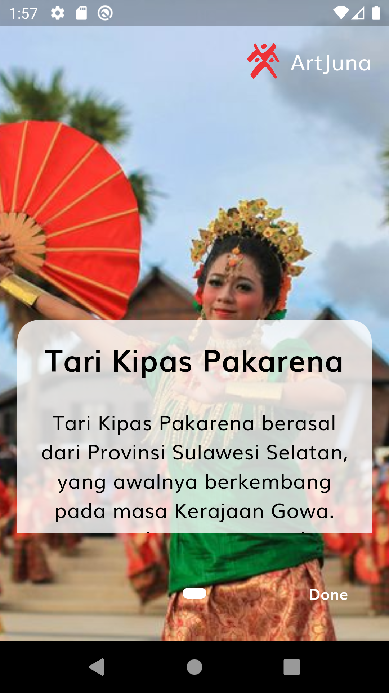 | 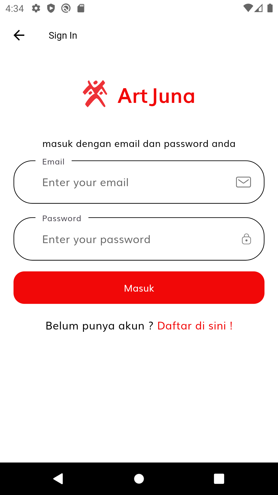 | 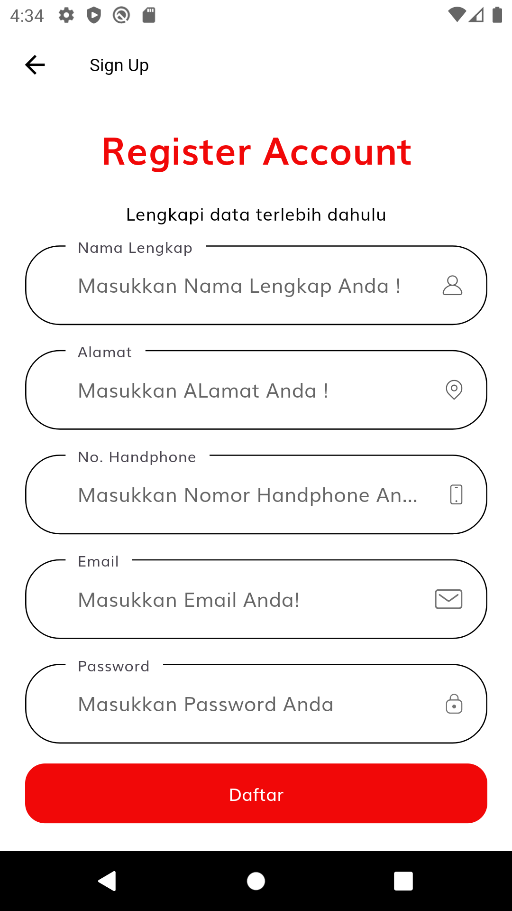 | 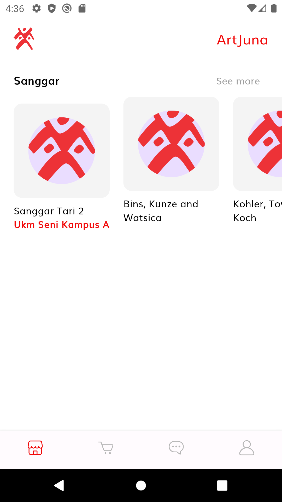 | 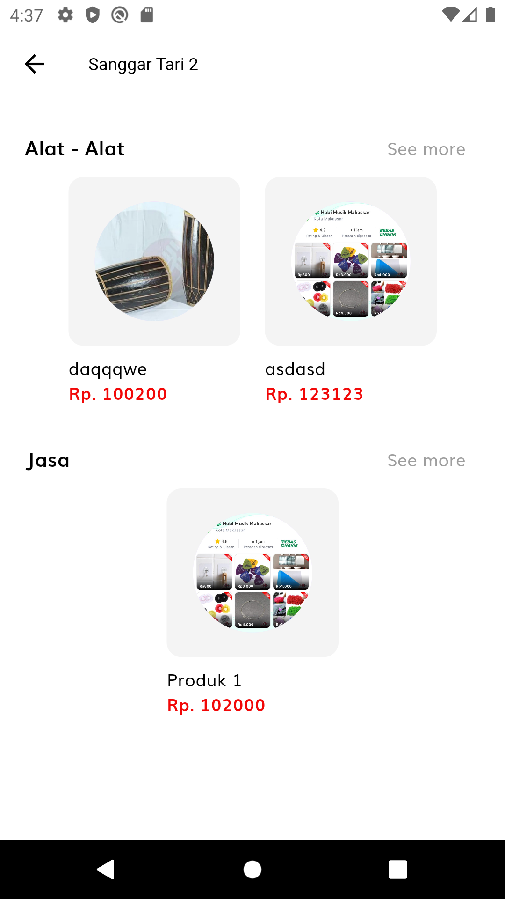 | 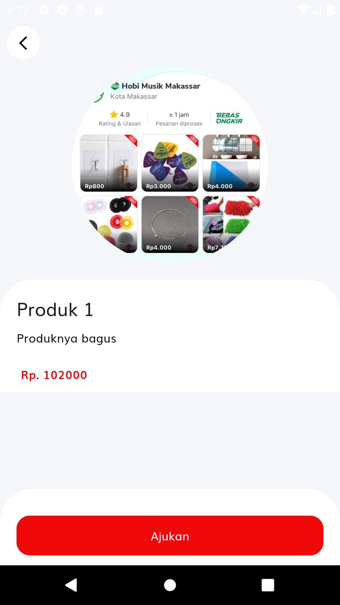 | 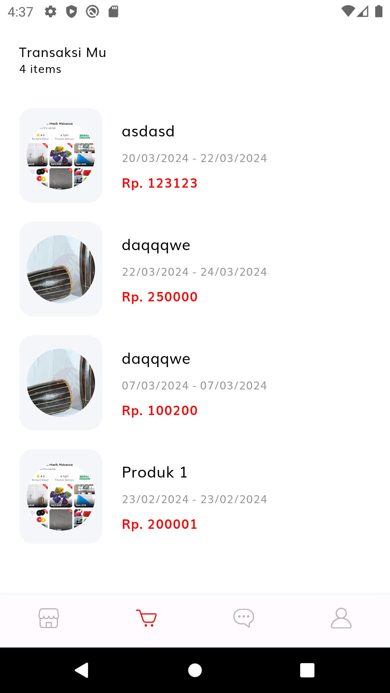 | 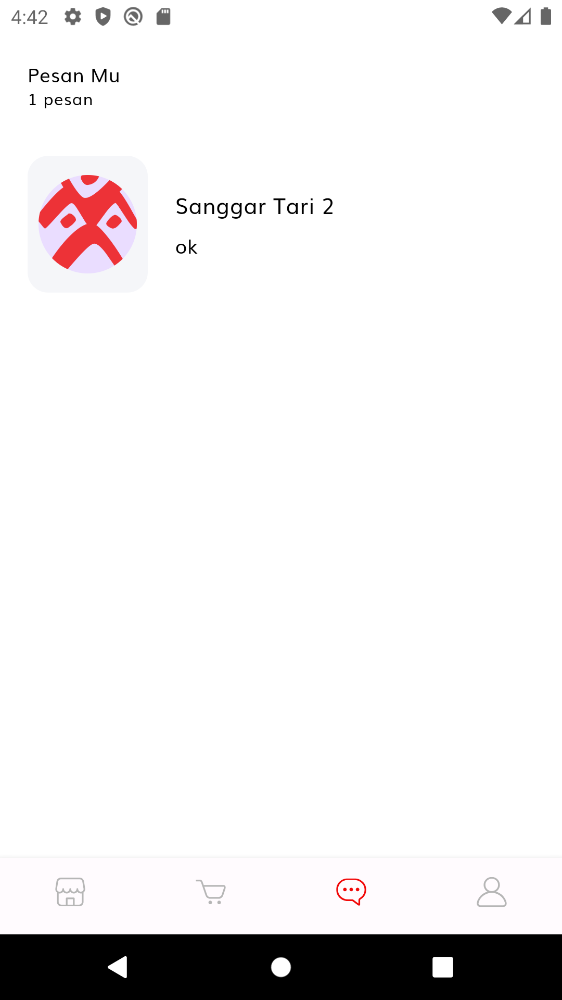 | 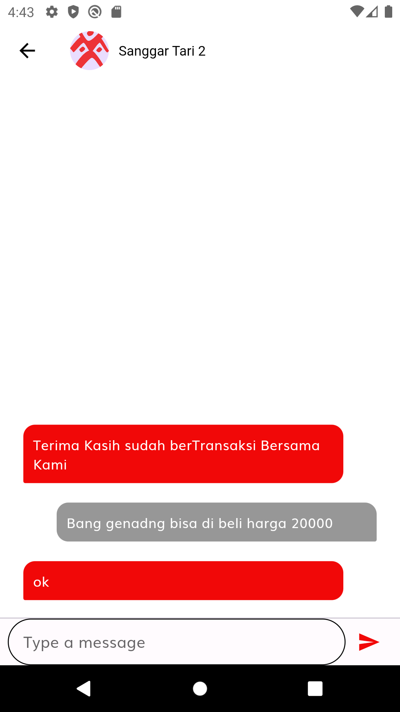 | 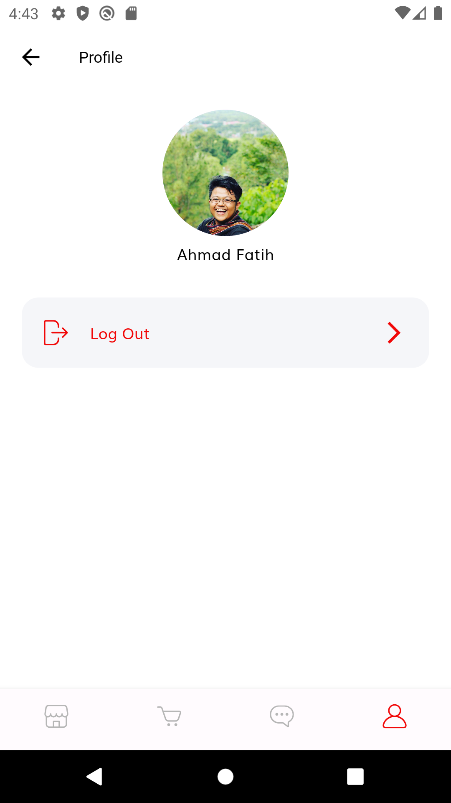 |
|--------------------------|------------------------|--------------------------------|----------------------|----------------------------|---------------------------------|--------------------------------|----------------------------------|------------------------|--------------------------|
| Splash Screen            | Tampilan Login         | Halaman Regitrasi              | Halaman Home         | Halaman Etalase Sanggar    | Halaman Detail Produk           | Halaman Transaksi              | Halaman Daftar Pesan             | Halaman Pesan          | Halaman Profil           |

## Technology

* Programming Leanguage
  * Dart

* Framework
  * Flatter

* Package
  * build runner
  * flutter bloc
  * freazed
  * freazed annotation
  * http
  * provider
  * shared praferences
  * introduction screen
  * flutter native splash

## Setup

1. Mengambil atau mengkonfigurasi package
   Pertama anda perlu melakukan semcam reboot project. hal ini adalah untuk mengenalkan projek baru tepada workspace kita. terkadang hal ini jika tidak dilakukan akan menimbulkan eror dalam project.
      ```PowerShell
        # Perintah untuk clear semua cache dan hal-hal dari env lama.
        flutter clean
        # Perintah untuk mendownload package yang dibutuhkan.
        flutter pub get
      ```
  
2. URL API
   Selanjutnya configurasi alamat domain yang menjadi API anda. anda bisa mengedit pada file constant.dart :
     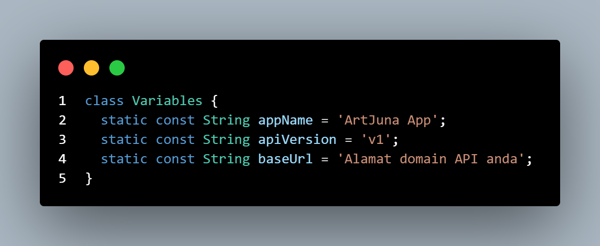
   
3. Configurasi API
   Jika anda menggunakan API yang tersedia pada Artjuna Admin anda bisa skip langkah ini. Selanjutnya anda perlu menyesuaikan nama api yang anda buat dan cari mengambil datanya pada setiap datasource. anda bisa memperhatikan baris ini.
   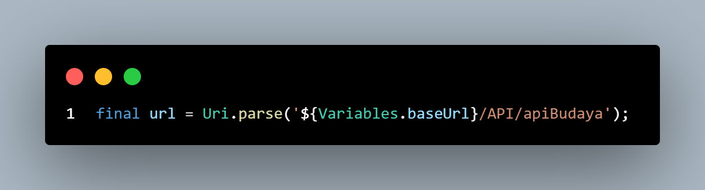
   
4. Jalankan device
   Untuk menjalankan device anda bisa menggunakan emulator atau real device anda dengan memilih pada bagian ini.
   ```PowerShell
    # Perintah untuk Seeder
    php spark serve
    ```
5. Selesai

   Jika semua sudah di konfigrasi dengan baik selanjutnya silahkan di rubah sesuai kebutuhan anda.

## Server Requirements

PHP version 8.1 or higher is required, with the following extensions installed:

- [intl](http://php.net/manual/en/intl.requirements.php)
- [mbstring](http://php.net/manual/en/mbstring.installation.php)

Additionally, make sure that the following extensions are enabled in your PHP:

- json (enabled by default - don't turn it off)
- [mysqlnd](http://php.net/manual/en/mysqlnd.install.php) if you plan to use MySQL
- [libcurl](http://php.net/manual/en/curl.requirements.php) if you plan to use the HTTP\CURLRequest library

## Contribution

Jika Anda ingin berkontribusi pada proyek ini, harap ikuti langkah-langkah di bawah ini:

1. Silakan fork repositori ini dan buat branch baru untuk fitur atau perbaikan yang Anda rencanakan.
2. Lakukan perubahan yang diperlukan.
3. Kirimkan pull request ke branch utama kami untuk ditinjau.
4. Pastikan kode Anda memenuhi pedoman kode kami.

## Lisensi

- Copyright © 2024 Fade28.
- **Sistem Informasi Akademik Sekolah is open-sourced software licensed under the [MIT license](LICENSE).**

## Created By

Proyek ini saya bangun berdua bersama partner saya dan di publish sebagai bentuk portofolio yang dapat di pertanggung jawabkan.
 1. Ahmad Fatih Fadhlillah
 2. Revan Arjuna Menda

## Contact

Jika anda tertarik diskusi lebih lanjut atau membangun kerjasama terkait dengan saya dapat menghubungi link dibawah ini :
- Facebook : <a href="https://www.facebook.com/fatihbro/">Ahmad Fati Fadhlillah</a>
- LinkedIn : <a href="https://www.linkedin.com/in/fatih-fadhlillah-876654241">Fade 28</a>
>>>>>>> 187792162197aed9ddc7c267399459d075fe0ba5
